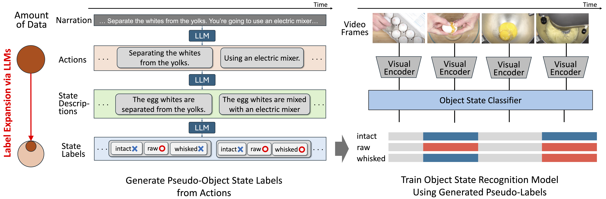

# **Learning Object States from Actions via Large Language Models**

[**Learning Object States from Actions via Large Language Models**](https://arxiv.org/abs/2405.01090)  
**Masatoshi Tateno**, **Takuma Yagi**, **Ryosuke Furuta**, **Yoichi Sato**

[](https://masatate.github.io/ObjStatefromAction.github.io/) [](https://arxiv.org/abs/2405.01090)


<div align="center">
  
</div>


### 🚀 **News**
We are excited to release the [**MOST** dataset](./MOST_dataset/) as part of this project!  
Training and evaluation code will be coming soon, so stay tuned!


## **Reference**
If you find this work useful in your research, please consider citing:

```bibtex
@article{tateno2024learning,
  title={Learning Object States from Actions via Large Language Models},
  author={Tateno, Masatoshi and Yagi, Takuma and Furuta, Ryosuke and Sato, Yoichi},
  journal={arXiv preprint arXiv:2405.01090},
  year={2024}
}