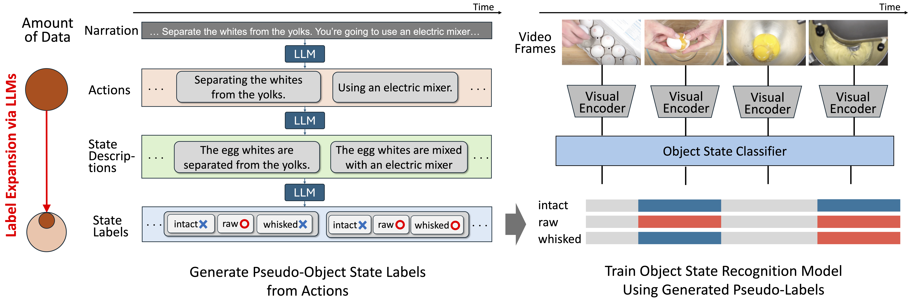

# **Learning Multiple Object States from Actions via Large Language Models (WACV 2025)**

[**Learning Multiple Object States from Actions via Large Language Models**](https://arxiv.org/abs/2405.01090)  
**Masatoshi Tateno**, **Takuma Yagi**, **Ryosuke Furuta**, **Yoichi Sato**

[](https://masatate.github.io/ObjStatefromAction.github.io/) [](https://arxiv.org/abs/2405.01090)


<div align="center">
  
</div>


### 🚀 **News**
- [April 2025] We released the [**evaluation code for CLIP baseline**](./baseline/) on MOST Dataset.
- [April 2025] We released the list of [**video ids for training**](./training/video_ids/).
- [Oct 2024] We are excited to release the [**MOST** dataset](./MOST_dataset/) as part of this project!  
- [Sep 2024] We are happy to announce our paper has been accepted for **WACV 2025🎉**


## **Reference**
If you find this work useful in your research, please consider citing:

```bibtex
@InProceedings{Tateno_2025_WACV,
    author    = {Tateno, Masatoshi and Yagi, Takuma and Furuta, Ryosuke and Sato, Yoichi},
    title     = {Learning Multiple Object States from Actions via Large Language Models},
    booktitle = {Proceedings of the Winter Conference on Applications of Computer Vision (WACV)},
    month     = {February},
    year      = {2025},
    pages     = {9537-9547}
}